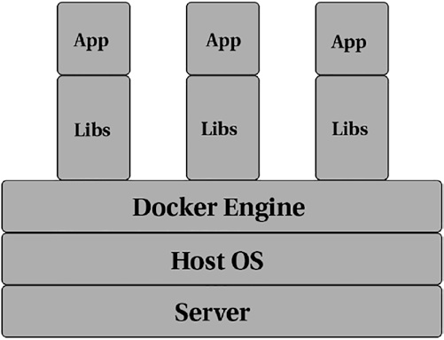
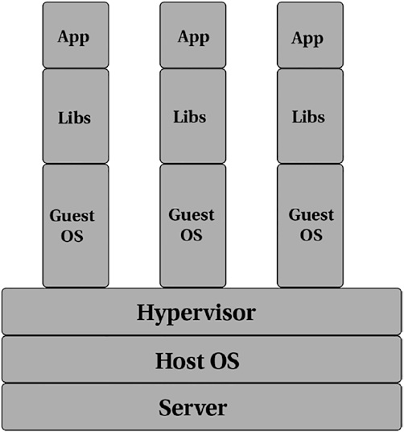
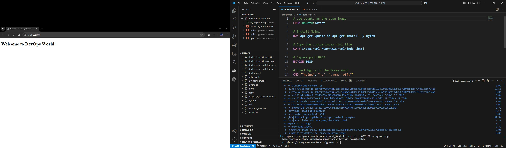
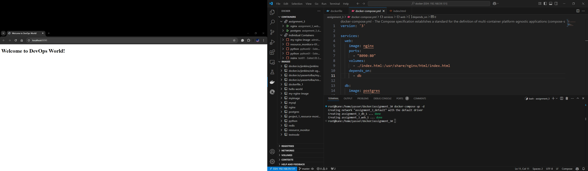
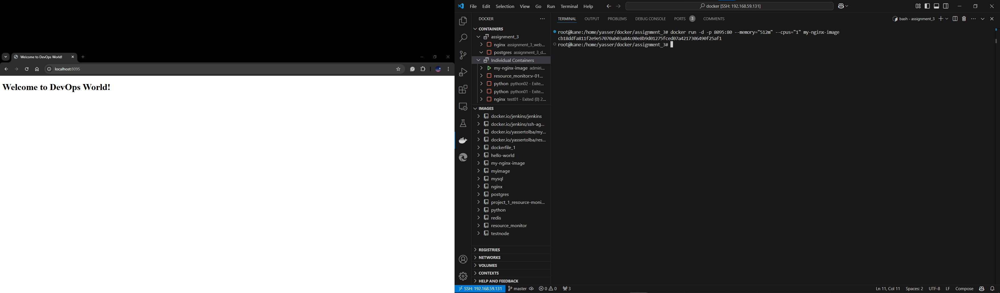

# DevOps Assignment 3: Docker

**Trainee Name: Yasser Ahmed**  
**Group: ALX2_SWD1_G1**  

## Theory Questions

### a) Docker Fundamentals

1. **What is a Docker container, and how does it differ from a virtual machine (VM)?**

   - A Docker container is a lightweight, self-contained, executable package that includes everything necessary to run a piece of software: code, runtime, libraries, and settings. Containers are based on Docker images and operate in isolated environments on the same operating system kernel.

   - Although containers isolate applications, they are not the same as virtual machines. The key difference is that containers share the host's kernel.

   - Docker isolates a single process (or a group of processes, depending on the image) and all containers run on the same host system. Since the isolation occurs at the kernel level, running containers doesn't impose heavy overhead on the host compared to virtual machines. When a container is launched, the designated process or group of processes runs on the same host, without the need for virtualization or emulation. [^1]

   - Figure 1 illustrates three apps running on three different containers on a single physical host.

   

   *Figure 1: Three apps running on three different containers* [^1]

   - **Difference from VMs:** Unlike VMs, which include a complete operating system and emulate hardware, Docker containers share the host OS kernel and are significantly more lightweight. This makes containers quicker to start, more efficient in resource usage, and easier to scale.

   - In contrast, when a virtual machine is started, the hypervisor virtualizes an entire system—from the CPU to RAM to storage. To support this virtualized system, a full operating system must be installed. [^1]

   - Essentially, a virtualized system is an entire computer running inside another computer.

   - Imagine the overhead required to run a single operating system, and then think about the additional overhead of running a nested operating system! [^1]

   - Figure 2 depicts three apps running on three different virtual machines on a single physical host.

   

   *Figure 2: Three apps running on three different virtual machines* [^1]

   - Figures 1 and 2 illustrate three different applications running on a single host.

   - With a VM, you need the application's dependent libraries and an operating system to run the application.

   - In comparison, containers share the host OS's kernel with the application, eliminating the overhead of an additional OS. This not only improves performance but also enhances resource utilization and minimizes wasted compute power. [^1]

   ---

2. **What is the purpose of a Dockerfile?**
   - Dockerfile is an automated way to build your Docker images.
   - Dockerfile contains special instructions that tell the Docker Engine about the steps required to build an image. [^1]

  **Explain the significance of directives like FROM, COPY, RUN, and CMD.**  [^1]

- **1) `FROM` Instruction:**
  - The `FROM` instruction tells the Docker Engine the base image to be used for subsequent instructions. Every valid Dockerfile must start with a `FROM` instruction. [^1]

     ```Dockerfile
        FROM <image> [AS <name>]
        FROM <image>[:<tag>] [AS <name>]
        FROM <image>[@<digest>] [AS <name>]   
     ```

  - Where `image` is the name of a valid Docker image from any public/private repository.
  - if the `tag` is skipped, Docker will fetch the image tagged as `latest`.

     ---

- **2) `WORKDIR` Instruction:**
  - The `WORKDIR` instruction sets the current working directory for the `RUN`, `CMD`, `ENTRYPOINT`, `COPY`, and `ADD` instructions.
  - `WORKDIR` is useful when you have multiple directories in the source code and you want some specific actions to be done within these specific directories.
  - `WORKDIR` is also frequently used to set a separate location for the application to run in the container. The syntax is as follows:

       ```Dockerfile
          WORKDIR /path/to/directory
       ```

  - WORKDIR can be set multiple times in a Dockerfile and, if a relative directory succeeds a previous WORKDIR instruction, it will be relative to the previously set working directory. Let’s look at an example demonstrating this. Consider this Dockerfile:

       ```Dockerfile
          FROM ubuntu:latest
          WORKDIR /app
          CMD pwd
       ```

  - The Dockerfile fetches the `latest` tagged image from Ubuntu as the base image, sets the current working directory to `/app`, and runs the `pwd` command when the image is run. The `pwd` command prints the current working directory.

       ```bash
          docker build -t yassertolba/workdir .
       ```

       ```bash
          docker run yassertolba/workdir
          /app
       ```

  - Modify the Dockerfile to add a couple of WORKDIR instructions, as shown here:

       ```Dockerfile
          FROM ubuntu:latest
          WORKDIR /usr
          WORKDIR src
          WORKDIR app
          CMD pwd
       ```

       ```bash
          docker build -t yassertolba/workdir .
       ```

       ```bash
          docker run yassertolba/workdir
          /usr/src/app
       ```

  - By default, the `WORKDIR` is set as `/`, so any WORKDIR instructions featuring a relative directory will be appended to `/`

       ---

- **3) `ADD and COPY` Instructions:**
  - the ADD and COPY instructions allow you to transfer files from the host to the container’s filesystem.

  - `COPY` supports basic copying of files to the container.

  - `ADD` has support for features like tarball auto extraction (i.e., Docker will automatically extract compressed files added from local directory) and remote URL support (i.e., Docker will download the resources from a remote URL).

  - The syntax for both are quite similar:

       ```Dockerfile
          ADD <source> <destination>
          COPY <source> <destination>
       ```

  - The `ADD` instruction is useful when you’re adding files from remote URLs or you have compressed files from the local filesystem that need to be automatically extracted into the container filesystem.

      ```Dockerfile
          COPY text.txt /app/
      ```

      ```docker
          ADD URL.tar /app/
      ```

  - For Dockerfiles used to build Linux containers, both instructions let you change the owner/group of the files being added to the container. This is done using the `--chown` flag, as follows:

      ```docker
          ADD --chown=<user>:<group> <source> <destination>
          COPY --chown=<user>:<group> <source> <destination>
      ```

  - Both ADD and COPY support wildcards while specifying patterns. For example, having the following instructions in your Dockerfile will copy all the files with the .py extension to the /apps/ directory of the image.

      ```docker
          ADD *.py /apps/
          COPY *.py /apps/
      ```

  - Both ADD and COPY can send all riles in the working directory to the working directory of the container.

      ```docker
          ADD . .
          COPY . .
      ```  

- **4) `RUN` Instruction:**
  - The `RUN` instruction will execute any command during the build step of the container.

  - This creates a new layer that is available for the next steps in the Dockerfile.

  - It is important to note that the command following the `RUN` instruction runs only when the image is being built.

  - The `RUN` instruction has no relevance when a container has started and is running.

  - `RUN` has two forms, the shell form and the exec form. [^1]
  
  - In the shell form, the command is written space-delimited, as shown here:

    ```docker
    RUN <command>
    ```

    ```docker
    RUN echo `Hello` > test.txt
    ```

  - In exec form, the command is written comma-delimited and surrounded by quotes, as shown here:

    ```docker
    RUN ["executible", "parameter 1", " parameter 2"] (the exec form)
    ```

  - Unless you need to use `shell` features like chaining and redirection, it is recommended to use the `exec` form for the `RUN` instruction.

  - When the image is built, Docker will cache the layers that it has pulled.

  - instead of redownloading the layer for the base Ubuntu image, Docker uses the cached layer saved to disk.

  - This applies to all the layers that are created—and Docker creates a new layer whenever it encounters `RUN`, `COPY`, or `ADD` instructions.

  - Due to the way layer caching works, it is always best to chain the package update and package install as a single `RUN` instruction.

  - To reduce the number of layers, and to prevent packages not being able to be installed due to the package cache being out of date, it is best to chain the update and installs, as shown here:

    ```docker
    RUN apt-get update && apt-get install -y \
    pkg1 \
    pkg2 \
    pkg3 \
    pkg4
    ```

  - This creates a single layer with the packages to be installed, and any change in any of the packages will invalidate the cache and cause a new layer to be created with the updated packages.

  - If you want to explicitly instruct Docker to avoid using the cache, then passing `--no-cache` flag to the docker build command will skip using the cache. [^1]

  ---

- **5) `CMD` and `ENTRYPOINT` Instructions:**
  - The CMD and ENTRYPOINT instructions define which command is executed when running a container.

    ```docker
    CMD ["executable","param1","param2"] (exec form)

    CMD ["param1","param2"] (as default parameters to ENTRYPOINT)

    CMD command param1 param2 (shell form)


    ENTRYPOINT ["executable", "param1", "param2"] (exec form)

    ENTRYPOINT command param1 param2 (shell form)
    ```

  - The ENTRYPOINT instruction is best when you want your container to function like an executable, and the CMD instruction provides the defaults for an executing container.

    ```docker
    FROM ubuntu:latest
    RUN apt-get update && \
    apt-get install -y curl && \
    rm -rf /var/lib/apt/lists/*
    CMD ["ls","-al", "/var/lib/apt/lists/"]
    ```

    ```docker
    FROM ubuntu:latest
    RUN apt-get update && \
    apt-get install -y curl
    ENTRYPOINT ["ls","-al", "/var/lib/apt/lists/"]
    ```

    ```docker
    FROM ubuntu:latest
    RUN apt-get update && \
    apt-get install -y curl && \
    rm -rf /var/lib/apt/lists/*
    CMD ["-al", "/var/lib/apt/lists/"]
    ENTRYPOINT ["ls"]
    ```

    ---

- **5) `ENV` Instruction:**
  - The `ENV` instruction sets the environment variables to the image.

    ```docker
    ENV <key> <value>
    ENV <key>=<value> ...
    ```

  - In the first form, the entire string after the `<key>` is considered the `value`, including whitespace characters. Only one variable can be set per line in this form.

  - In the second form, multiple variables can be set at one time, with the equals `=` character assigning value to the key.

  - The environment variables set are persisted through the container runtime. They can be viewed using docker inspect.

    ```docker
    FROM ubuntu:latest
    ENV LOGS_DIR="/var/log"
    ENV APPS_DIR /apps/
    ```

  - The environment variables defined for a container can be changed when running a container with the `-e` flag.

    ```bash
    docker run -it -e LOGS_DIR="/logs" yassertolba/env

    docker run -it -e LOGS_DIR="/logs" -e APPS_DIR="/opt" yassertolba/env
    ```

    ```bash
    printenv | grep DIR
    LOGS_DIR=/logs
    APPS_DIR=/opt
    ```

    - Type exit to close the interactive terminal of the container.

- **6) `VOLUME` Instruction:**
  - The VOLUME instruction tells Docker to create a mount point on the container and mount it externally from the host.

    ```docker
    VOLUME /var/logs/nginx
    ```

  - Tells Docker to mark the /var/logs/nginx directory as a mount point, with the data being mounted from the Docker host.
  
  - This, when combined with the `volume` flag on the Docker run command, will result in data being persisted on the Docker host as a volume.

  - This volume can then be backed up, moved, or transferred using Docker CLI commands. [^1]

- **7) `EXPOSE` Instruction:**
  - The EXPOSE instruction tells Docker that the container listens for the specified network ports at runtime.

    ```docker
    EXPOSE <port> [<port>/<protocol>...]
    ```

  - To expose port 80

    ```docker
    EXPOSE 80
    ```

  - To expose port 53 on TCP and UDP

    ```docker
    EXPOSE 53/tcp
    EXPOSE 53/udp
    ```
  
  - If not specified, Docker assumes the protocol to be TCP

  - An `EXPOSE` instruction doesn’t publish the port. For the port to be published to the host, you need to use the `-p` flag with docker run to publish and map the ports.

  - Dockerfile uses the nginx image with port 80 exposed in the container.

    ```docker
    FROM nginx:alpine
    EXPOSE 80
    ```

- To run this container, you have to provide the host port to which it is to be mapped. Map it to port 8080 on the host to port 80 of the container.

  ```bash
  docker run -d -p 8080:80 myimage:v01
  ```

- **8) `LABEL` Instruction:**
  - The LABEL instruction adds metadata to an image as a key-value pair.

    ```docker
    LABEL <key>=<value> <key>=<value> <key>=<value> ...
    ```

    ---

[^1]: [Practical Docker with Python - Second Edition](https://doi.org/10.1007/978-1-4842-7815-4)

### b) Image Management

1. **Describe the layers of a Docker image. How does Docker optimize space and performance using these layers?**
   - Docker images are built in layers, with each layer representing an instruction in the Dockerfile. Layers are stacked on top of each other, and changes are stored as incremental layers.
   - **Optimization:** Docker uses a Union File System to manage these layers, allowing it to reuse unchanged layers between different images. This optimizes space and performance by reducing redundancy and speeding up the build process, as only the changed layers need to be rebuilt.

2. **What are the benefits of using Docker volumes? Give an example where data persistence is crucial in a Docker container.**

   - Docker volumes provide a way to store data outside of the container's filesystem, ensuring data persists even if the  container is deleted.

   - **Example:** In a database container, data persistence is crucial. Using Docker volumes allows the database to retain its  data across container restarts or updates.

   - Using Docker volumes is a great way to ensure data persistence in Docker containers. Let's create a simple example of a  Docker setup with a MySQL database where data persistence is crucial.

   - Here’s how you can do it using a `Dockerfile` and a `docker-compose.yml` file:

   ### Dockerfile

   ```Dockerfile
   FROM mysql:8.0
   
   # Set environment variables
   ENV MYSQL_ROOT_PASSWORD=rootpassword
   ENV MYSQL_DATABASE=mydatabase
   ENV MYSQL_USER=user
   ENV MYSQL_PASSWORD=password
   
   # Expose the MySQL port
   EXPOSE 3306
   ```

   ### docker-compose.yml

   ```yaml
   version: '3.1'
   
   services:
     db:
       build: .
       container_name: my_mysql_db
       volumes:
         - db_data:/var/lib/mysql
       environment:
         MYSQL_ROOT_PASSWORD: rootpassword
         MYSQL_DATABASE: mydatabase
         MYSQL_USER: user
         MYSQL_PASSWORD: password
       ports:
         - "3306:3306"
   
   volumes:
     db_data:
   ```

   ### Explanation

   - **Dockerfile:** Defines the Docker image for MySQL with environment variables to set up the root password, database name, user, and password.
   - **docker-compose.yml:** Defines the services and configurations for Docker Compose. In this file:
     - `db` service is built from the Dockerfile.
     - A volume `db_data` is created and mapped to `/var/lib/mysql` inside the container, which is the location where MySQL stores    its data.
     - The environment variables are set to configure the MySQL database.
     - The container's port 3306 is mapped to the host's port 3306.

   - By using Docker volumes, the MySQL data is stored outside the container's filesystem in the `db_data` volume. This ensures that the data is not lost when the container is stopped, deleted, or updated. Even if you recreate the container, the data in the `db_data` volume will persist.

---

### c) Networking in Docker

1. **How does Docker handle networking? Explain the difference between bridge, host, and none network modes in Docker.**
   - container networking helps in allowing (or limiting) cross-container talk. And to facilitate this process, Docker comes with different modes of networks.

   - Docker provides several networking options to connect containers to each other and to the outside world.
     - **Bridge:** Default mode; creates a private internal network on the host that allows containers to communicate with each other.
     - **Host:** Uses the host's network stack directly, giving the container the same network interfaces as the host.
     - **None:** Disables networking; the container has no network interfaces apart from the loopback.

   - It is important to note that all of Docker’s networking modes are achieved via Software Defined Networking (SDN). Specifically, on Linux systems, Docker modifies IP-tables rules to provide the required level of access/isolation.

2. **Describe how you would configure container-to-container communication within a Docker network.**
   - Create a user-defined bridge network and attach containers to this network. Containers on the same network can communicate using their container names as hostnames.

    1. **Create a user-defined bridge network:**

       ```bash
       docker network create my_bridge_network
       ```

    2. **Run containers and attach them to the created network:**

       ```bash
       docker run -d --name container1 --network my_bridge_network nginx
       docker run -d --name container2 --network my_bridge_network redis
       ```

    3. **Verify the network configuration:**
   You can check if the containers are attached to the `my_bridge_network` using the following command:

   ```bash
   docker network inspect my_bridge_network
   ```

- By attaching containers to the same user-defined bridge network, they can communicate with each other using their container names as hostnames.

- For example, from within `container1`, you can communicate with `container2` using `container2` as the hostname, and vice versa.

## Practical Task

### a) Dockerfile Creation

Create a `Dockerfile` with the following content:

```Dockerfile
# Use Ubuntu as the base image
FROM ubuntu:latest

# Install Nginx
RUN apt-get update && apt-get install -y nginx

# Copy the custom index.html file
COPY index.html /var/www/html/index.html

# Expose port 8089 
EXPOSE 8089

# Start Nginx in the foreground
CMD ["nginx", "-g", "daemon off;"]
```

Create a custom `index.html` file with the content:

```html
<!DOCTYPE html>
<html lang="en">
<head>
    <meta charset="UTF-8">
    <title>Welcome to DevOps World!</title>
</head>
<body>
    <h1>Welcome to DevOps World!</h1>
</body>
</html>
```

Build the Docker image:

```sh
docker build -t my-nginx-image .
```

Verify its functionality:

```sh
docker run -d -p 8089:80 my-nginx-image
```

   

### b) Multi-Container Setup

Create a `docker-compose.yml` file with the following content:

```yaml
version: '3'

services:
  web:
    image: nginx
    ports:
      - "8090:80"
    volumes:
      - ./index.html:/usr/share/nginx/html/index.html
    depends_on:
      - db

  db:
    image: postgres
    environment:
      POSTGRES_USER: user
      POSTGRES_PASSWORD: password
      POSTGRES_DB: mydb
    volumes:
      - db-data:/var/lib/postgresql/data

volumes:
  db-data:
```

   

#### c) Resource Limiting

Run the web server container with resource limits:

```sh
docker run -d -p 8095:80 --memory="512m" --cpus="1" my-nginx-image
```

   

**Explanation:** Docker resource limits help prevent a single container from consuming excessive resources, ensuring fair resource allocation and improving the stability and performance of the overall system in a production environment.
